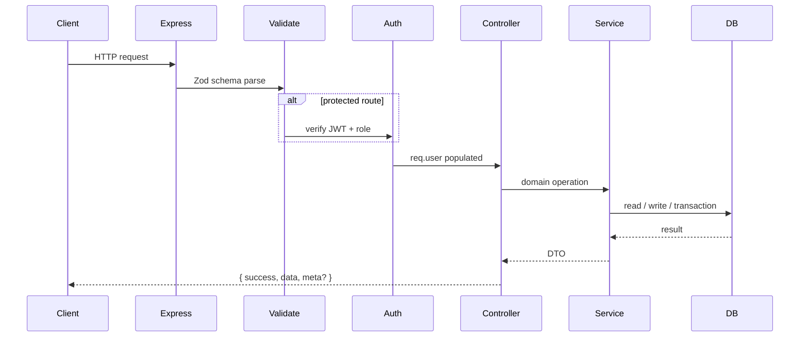

# Commit Gear API

Production-oriented backend for **Commit Gear** , a premium developer merchandise marketplace. Built with Node.js, TypeScript, Express, MongoDB, Redis, and Paystack.

The codebase is structured as a layered REST API with explicit separation of concerns, dependency injection, provider abstractions for external services, and defensive patterns around auth, inventory, payments, and caching.

---

## Table of Contents

- [Architecture](#architecture)
- [Engineering Highlights](#engineering-highlights)
- [Security](#security)
- [Data Layer](#data-layer)
- [API Reference](#api-reference)
- [Response Contract](#response-contract)
- [Error Handling](#error-handling)
- [Configuration](#configuration)
- [Local Development](#local-development)
- [Testing](#testing)
- [Project Structure](#project-structure)
- [Production Notes](#production-notes)

---

## Architecture

### Layered design

Every request flows through a predictable stack:

```
HTTP Request
    │
    ▼
┌─────────────────────────────────────────┐
│  Express middleware                     │
│  helmet · cors · rate-limit · sanitize  │
└─────────────────────────────────────────┘
    │
    ▼
┌─────────────────────────────────────────┐
│  Routes + Zod validation                │
│  auth middleware · role authorization   │
└─────────────────────────────────────────┘
    │
    ▼
┌─────────────────────────────────────────┐
│  Controllers (thin HTTP orchestration)  │
└─────────────────────────────────────────┘
    │
    ▼
┌─────────────────────────────────────────┐
│  Services (business logic)              │
└─────────────────────────────────────────┘
    │
    ├──► Repositories ──► MongoDB (Mongoose)
    │
    └──► Providers ──► Redis · Paystack · Cloudinary
```

| Layer | Responsibility |
|-------|----------------|
| **Routes** | URL mapping, middleware composition, input validation entry points |
| **Controllers** | Parse HTTP context, call services, shape responses, delegate errors |
| **Services** | Business rules, authorization checks, transactions, cache orchestration |
| **Repositories** | MongoDB queries, atomic updates, pagination |
| **Providers** | Swappable integrations behind typed interfaces (`CacheProvider`, `PaymentProvider`, `StorageProvider`) |
| **Models** | Mongoose schemas, indexes, document shapes |

### Dependency injection

`createContainer()` wires the full object graph at startup. Services receive their dependencies through constructors; controllers receive the container and pull only what they need. This keeps integration points testable and makes mock providers trivial to swap in for local development.

```typescript
// container.ts — provider selection based on environment
const paymentProvider = env.PAYSTACK_SECRET_KEY
  ? new PaystackProvider({ ... })
  : new MockPaystackProvider();

const cache = env.REDIS_URL
  ? new RedisCacheProvider(env.REDIS_URL)
  : new NullCacheProvider();
```

### Request lifecycle



---

## Engineering Highlights

### 1. Double-token authentication

Auth uses a **short-lived access token** (JWT, 15 min default) plus a **long-lived refresh token** (7 days) stored as an HttpOnly cookie.

| Concern | Implementation |
|---------|----------------|
| Password storage | bcrypt, 12 rounds |
| Refresh token storage | SHA-256 hash only — raw token never persisted |
| Token rotation | Each refresh invalidates the old token and issues a new one |
| Session cap | Max 5 concurrent refresh tokens per user (oldest evicted) |
| Cookie scope | `HttpOnly`, `SameSite=strict`, path `/api/v1/auth` |

**Roles:** `buyer` · `vendor` · `admin` — enforced via composable `authorize(...roles)` middleware on every protected route.

### 2. Atomic checkout with inventory guards

Checkout is the most critical write path. It is designed to prevent overselling under concurrency:

1. **Pre-flight validation** — verify every cart line against live inventory before any mutation
2. **MongoDB transaction** — wrap inventory decrements, order creation, and cart clearing in a single session
3. **Atomic decrement** — `findOneAndUpdate` with `{ inventory: { $gte: quantity } }` + `$inc` ensures no race can drive inventory negative
4. **Price snapshotting** — order line items capture `priceAtPurchase` and `imageSnapshot` at checkout time

On failure, the transaction rolls back entirely — no partial orders, no orphaned inventory changes.

### 3. Redis read-through caching

Product and category reads use a **read-through cache** with explicit eviction on writes:

| Cache key | TTL | Invalidated when |
|-----------|-----|------------------|
| `categories:all` | 1 hour | Category create / update / delete |
| `products:list:{hash}` | 5 min | Any product write |
| `products:detail:{id}` | 10 min | That product is updated or deleted |

List cache keys are derived from a SHA-256 hash of normalized query params (page, limit, category, price range, search term) so every filter combination gets its own entry.

**Graceful degradation:** If Redis is unavailable, `RedisCacheProvider` bypasses cache reads/writes for 60 seconds and falls back to direct MongoDB queries. `NullCacheProvider` is used when `REDIS_URL` is unset.

### 4. Paystack payment integration

Payments follow a provider abstraction so the core order logic never depends on Paystack directly.

| Step | Endpoint | Behavior |
|------|----------|----------|
| Initialize | `POST /payments/initialize` | Creates Paystack checkout session, stores `paymentReference` on order |
| Webhook | `POST /payments/webhook/paystack` | HMAC signature verification on raw body, idempotent status update |
| Verify | `GET /payments/verify/:reference` | Client-side fallback poll against Paystack API |

Webhook handler is idempotent: duplicate `charge.success` events on already-paid orders are ignored. Amount mismatches raise `AMOUNT_MISMATCH` before mutating state.

**Local dev:** Without Paystack credentials, `MockPaystackProvider` returns synthetic checkout URLs and accepts all webhook/verify calls.

### 5. Server-persisted cart

Carts live in MongoDB keyed by `userId`, not in client storage. Each cart response is enriched server-side with live product data (title, price, image, available inventory) so the client always sees current catalog state.

Inventory is checked on add and update — attempting to exceed available stock returns `INVENTORY_CONFLICT` with structured conflict details.

### 6. Input validation with Zod

All request bodies, query strings, and route params are validated through Zod schemas before reaching controllers. Validation failures return `400 VALIDATION_ERROR` with a per-field breakdown:

```json
{
  "success": false,
  "message": "Validation failed",
  "error": {
    "code": "VALIDATION_ERROR",
    "details": {
      "fields": [{ "field": "email", "message": "Invalid email" }]
    }
  }
}
```

ObjectId params are validated with a dedicated `objectIdSchema` — no invalid IDs reach MongoDB.

### 7. Structured error taxonomy

All operational errors extend `AppError` with HTTP status, machine-readable `code`, and optional `details`:

| Class | Status | Example codes |
|-------|--------|---------------|
| `ValidationError` | 400 | `VALIDATION_ERROR` |
| `UnauthorizedError` | 401 | `INVALID_CREDENTIALS`, `REFRESH_TOKEN_INVALID` |
| `ForbiddenError` | 403 | `FORBIDDEN` |
| `NotFoundError` | 404 | `NOT_FOUND`, `PRODUCT_NOT_FOUND` |
| `ConflictError` | 409 | `EMAIL_EXISTS`, `INVENTORY_CONFLICT`, `CATEGORY_HAS_PRODUCTS` |

Unhandled exceptions are logged at error level and never leak stack traces to clients.

### 8. Vendor ownership model

Vendors can only mutate their own products. Admins bypass ownership checks. Product soft-delete sets `isActive: false` and updates category product counts — nothing is hard-deleted from the catalog.

Admin can override inventory directly (`PATCH /admin/products/:id/inventory`) and promote buyers to vendors (`POST /admin/vendors/:id/approve`).

### 9. Image uploads via streaming

Product images are uploaded through Multer (memory storage, 5 MB limit) and streamed directly to Cloudinary — no temp files on disk. Without Cloudinary credentials, `MockStorageProvider` returns placeholder URLs.

---

## Security

| Control | Detail |
|---------|--------|
| **Helmet** | Security headers on all responses |
| **CORS** | Configurable origins, credentials enabled for refresh cookies |
| **Rate limiting** | Auth routes: 100 req / 15 min · Catalog routes: 300 req / 15 min |
| **NoSQL injection** | `express-mongo-sanitize` strips `$` and `.` from user input |
| **Webhook integrity** | Paystack HMAC verified against raw request body (registered before `express.json()`) |
| **Password policy** | Min 8 chars enforced at schema level |
| **JWT secret** | Required via environment — no hardcoded secrets |

---

## Data Layer

### Collections

| Model | Purpose | Notable fields / indexes |
|-------|---------|--------------------------|
| **User** | Accounts + refresh token store | Unique email index, embedded `refreshTokens[]` |
| **Category** | Product taxonomy | Unique slug (`hoodies`, `keycaps`, `desk-pads`) |
| **Product** | Catalog items | Text index for search, vendor ownership, soft-delete via `isActive` |
| **Cart** | Per-user shopping cart | Unique `userId`, embedded line items |
| **Order** | Purchase records | Payment reference, status machine, price snapshots |

### Order status machine

```
pending → processing → shipped → delivered
    └── cancelled
```

Payment status runs independently: `pending` → `paid` | `failed` | `refunded`

Successful payment automatically advances order status from `pending` to `processing`.

---

## API Reference

**Base URL:** `http://localhost:5000/api/v1`  
**Health check:** `GET /health`

All authenticated routes require `Authorization: Bearer <accessToken>` unless noted.

### Auth

| Method | Path | Auth | Description |
|--------|------|------|-------------|
| `POST` | `/auth/register` | — | Create buyer account |
| `POST` | `/auth/login` | — | Login, receive access token + refresh cookie |
| `POST` | `/auth/refresh` | Cookie | Rotate refresh token, receive new access token |
| `POST` | `/auth/logout` | ✓ | Revoke refresh token |
| `GET` | `/auth/me` | ✓ | Current user profile |

### Products

| Method | Path | Auth | Role | Description |
|--------|------|------|------|-------------|
| `GET` | `/products` | — | — | List with pagination, category, price range, full-text search |
| `GET` | `/products/:id` | — | — | Product detail (cached) |
| `POST` | `/products` | ✓ | vendor, admin | Create product |
| `PATCH` | `/products/:id` | ✓ | vendor, admin | Update product |
| `DELETE` | `/products/:id` | ✓ | vendor, admin | Soft-delete product |

**List query params:** `page`, `limit`, `category`, `minPrice`, `maxPrice`, `q`

### Categories

| Method | Path | Auth | Role | Description |
|--------|------|------|------|-------------|
| `GET` | `/categories` | — | — | List all categories (cached) |
| `GET` | `/categories/:id` | — | — | Category detail |
| `POST` | `/categories` | ✓ | admin | Create category |
| `PATCH` | `/categories/:id` | ✓ | admin | Update category |
| `DELETE` | `/categories/:id` | ✓ | admin | Delete (blocked if products exist) |

### Cart

| Method | Path | Auth | Role | Description |
|--------|------|------|------|-------------|
| `GET` | `/cart` | ✓ | buyer, vendor, admin | Get enriched cart |
| `DELETE` | `/cart` | ✓ | buyer, vendor, admin | Clear all items |
| `POST` | `/cart/items` | ✓ | buyer, vendor, admin | Add item `{ productId, quantity }` |
| `PATCH` | `/cart/items/:productId` | ✓ | buyer, vendor, admin | Update quantity |
| `DELETE` | `/cart/items/:productId` | ✓ | buyer, vendor, admin | Remove item |

### Orders

| Method | Path | Auth | Role | Description |
|--------|------|------|------|-------------|
| `POST` | `/orders/checkout` | ✓ | buyer, vendor, admin | Atomic checkout `{ shippingAddress }` |
| `GET` | `/orders` | ✓ | buyer, vendor, admin | User order history (paginated, filterable by status) |
| `GET` | `/orders/:id` | ✓ | buyer, vendor, admin | Order detail (owner or admin only) |
| `PATCH` | `/orders/:id/status` | ✓ | admin | Update fulfillment status |

### Payments

| Method | Path | Auth | Description |
|--------|------|------|-------------|
| `POST` | `/payments/initialize` | ✓ | Start Paystack checkout `{ orderId, callbackUrl? }` |
| `POST` | `/payments/webhook/paystack` | — | Paystack webhook (signature verified) |
| `GET` | `/payments/verify/:reference` | ✓ | Poll payment status |

### Uploads

| Method | Path | Auth | Role | Description |
|--------|------|------|------|-------------|
| `POST` | `/uploads/images` | ✓ | vendor, admin | Upload image (multipart `file`, optional `folder`) |

### Admin

| Method | Path | Auth | Description |
|--------|------|------|-------------|
| `GET` | `/admin/vendors` | admin | List buyers pending vendor approval |
| `POST` | `/admin/vendors/:id/approve` | admin | Promote buyer to vendor |
| `GET` | `/admin/orders` | admin | All orders with status / payment filters |
| `PATCH` | `/admin/products/:id/inventory` | admin | Force inventory override |

---

## Response Contract

### Success

```json
{
  "success": true,
  "data": { },
  "meta": {
    "page": 1,
    "limit": 20,
    "total": 42,
    "totalPages": 3
  }
}
```

`meta` is included on paginated list endpoints only.

### Error

```json
{
  "success": false,
  "message": "Insufficient inventory for one or more items",
  "error": {
    "code": "INVENTORY_CONFLICT",
    "details": {
      "conflicts": [{ "productId": "...", "requested": 5, "available": 2 }]
    }
  }
}
```

---

## Error Handling

Controllers use a consistent try/catch → `next(error)` pattern. The global `errorHandler` middleware:

- Maps `AppError` subclasses to structured JSON responses
- Logs 5xx at error level, 4xx at warn level with error codes
- Catches unknown exceptions and returns a generic 500

A `notFoundHandler` catches unmatched routes before the error handler.

---

## Configuration

Copy `.env.example` to `.env`:

```bash
cp .env.example .env
```

| Variable | Required | Description |
|----------|----------|-------------|
| `NODE_ENV` | — | `development` or `production` |
| `PORT` | — | HTTP port (default `5000`) |
| `MONGODB_URI` | ✓ | MongoDB connection string |
| `REDIS_URL` | — | Redis URL; omit to disable caching |
| `JWT_SECRET` | ✓ | Access token signing secret |
| `JWT_ACCESS_EXPIRES_IN` | — | Access token TTL in seconds (default `900`) |
| `JWT_REFRESH_EXPIRES_IN` | — | Refresh token TTL in seconds (default `604800`) |
| `CORS_ORIGINS` | — | Comma-separated allowed origins |
| `PAYSTACK_SECRET_KEY` | — | Paystack secret key |
| `PAYSTACK_WEBHOOK_SECRET` | — | Paystack webhook HMAC secret |
| `CLOUDINARY_*` | — | Cloudinary credentials for image uploads |
| `SEED_ADMIN_EMAIL` | — | Admin email for seed script |
| `SEED_ADMIN_PASSWORD` | — | Admin password for seed script |

> **Docker note:** Redis is mapped to host port **6380** in `docker-compose.yml`. Set `REDIS_URL=redis://localhost:6380` when using Docker, or `6379` if running Redis locally.

---

## Local Development

### 1. Start infrastructure

```bash
docker compose up -d
```

| Service | Host port |
|---------|-----------|
| MongoDB | `27017` |
| Redis | `6380` → container `6379` |

### 2. Install and seed

```bash
npm install
cp .env.example .env   # adjust REDIS_URL if using Docker
npm run seed
```

Seed creates:
- Three categories (hoodies, keycaps, desk-pads)
- Admin user from `SEED_ADMIN_*` env vars
- Demo products if the catalog is empty

**Default admin:** `admin@commitgear.dev` / `AdminPass123!`

### 3. Run

```bash
npm run dev     # hot reload via tsx
npm run build   # compile TypeScript → dist/
npm start       # run compiled output
```

API available at `http://localhost:5000/api/v1`.

---

## Testing

Unit tests cover all eight domain controllers with mocked services (37 tests):

```bash
npm test          # run once
npm test:watch    # watch mode
```

```
tests/
├── helpers/
│   ├── http.ts          # mock req / res / next helpers
│   └── container.ts     # mock DI container
└── controllers/
    ├── auth.controller.test.ts
    ├── product.controller.test.ts
    ├── category.controller.test.ts
    ├── cart.controller.test.ts
    ├── order.controller.test.ts
    ├── payment.controller.test.ts
    ├── upload.controller.test.ts
    └── admin.controller.test.ts
```

Tests assert service delegation, HTTP status codes, response shape, cookie behavior, and error forwarding — without requiring MongoDB or Redis.

---

## Project Structure

```
src/
├── config/
│   ├── env.ts              # typed environment loader
│   └── database.ts         # MongoDB connection lifecycle
├── container.ts            # DI wiring, provider selection
├── app.ts                  # Express app factory, global middleware
├── index.ts                # bootstrap entry point
├── seed.ts                 # database seeder
│
├── controllers/            # thin HTTP handlers (one file per domain)
│   ├── auth.controller.ts
│   ├── product.controller.ts
│   ├── category.controller.ts
│   ├── cart.controller.ts
│   ├── order.controller.ts
│   ├── payment.controller.ts
│   ├── upload.controller.ts
│   ├── admin.controller.ts
│   └── index.ts            # barrel re-exports
│
├── middleware/
│   ├── auth.ts             # JWT verify, role guard, refresh cookies
│   ├── validate.ts         # Zod validation middleware
│   └── errorHandler.ts     # global error + 404 handlers
│
├── models/                 # Mongoose schemas + indexes
│   ├── User.ts
│   ├── Category.ts
│   ├── Product.ts
│   ├── Cart.ts
│   └── Order.ts
│
├── repositories/           # MongoDB data access
│   ├── UserRepository.ts
│   ├── CategoryRepository.ts
│   ├── ProductRepository.ts
│   ├── CartRepository.ts
│   └── OrderRepository.ts
│
├── services/               # business logic
│   ├── AuthService.ts
│   ├── ProductService.ts
│   ├── CategoryService.ts
│   ├── CartService.ts
│   ├── OrderService.ts
│   ├── PaymentService.ts
│   └── UploadService.ts
│
├── providers/              # external integrations
│   ├── RedisCacheProvider.ts
│   ├── NullCacheProvider.ts
│   ├── PaystackProvider.ts
│   ├── CloudinaryStorageProvider.ts
│   └── (mock variants for local dev)
│
├── routes/
│   └── index.ts            # route definitions + middleware chains
│
├── validators/
│   └── schemas.ts          # Zod request schemas
│
├── types/
│   └── index.ts            # shared interfaces (providers, roles, DTOs)
│
└── utils/
    ├── AppError.ts         # error class hierarchy
    ├── response.ts         # sendSuccess, buildMeta
    ├── serializers.ts      # document → API DTO mappers
    ├── cacheKeys.ts        # Redis key builders + TTL constants
    ├── tokens.ts           # refresh token generation + hashing
    ├── params.ts           # route param helpers
    └── logger.ts           # Winston structured logging
```

---

## Production Notes

- Set a strong, random `JWT_SECRET` — never commit real secrets
- Configure Paystack live keys and webhook secret; point Paystack webhook URL to `/api/v1/payments/webhook/paystack`
- Set `NODE_ENV=production` so refresh cookies are issued with `secure: true`
- Run Redis in production for catalog cache performance; the API degrades gracefully without it
- Use `npm run build && npm start` — do not run `tsx` in production
- Monitor Winston logs for `INVENTORY_CONFLICT` and payment webhook failures
- Consider adding MongoDB replica set for transaction support in production (required for multi-document transactions)

---

## Tech Stack

| Concern | Technology |
|---------|------------|
| Runtime | Node.js 22+, TypeScript 5 |
| HTTP | Express 4 |
| Database | MongoDB 7 (Mongoose 8) |
| Cache | Redis 7 (ioredis) |
| Auth | JWT + bcrypt + HttpOnly cookies |
| Validation | Zod 3 |
| Payments | Paystack |
| Storage | Cloudinary |
| Testing | Vitest 3 |
| Dev tooling | tsx (watch mode) |
