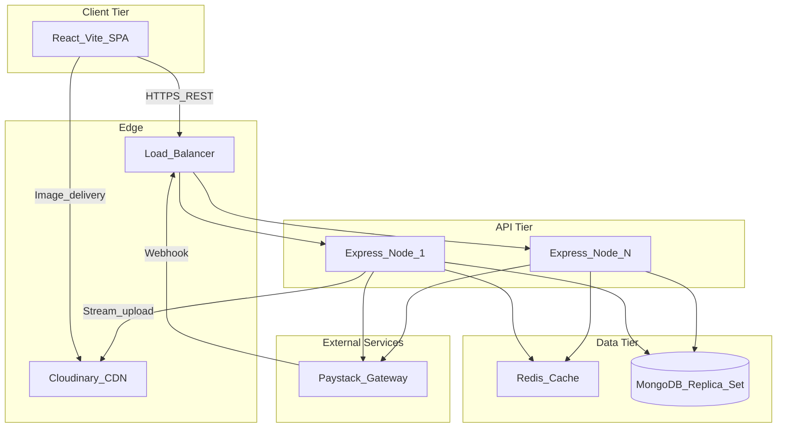
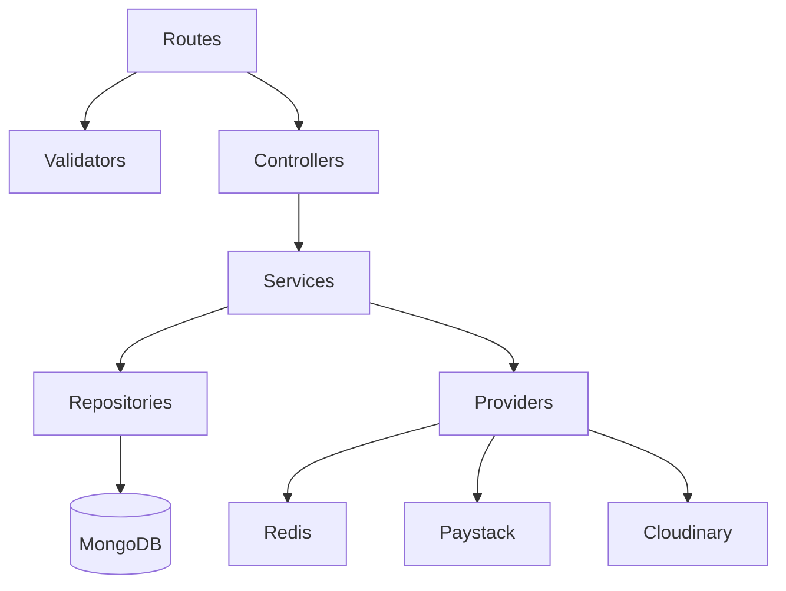
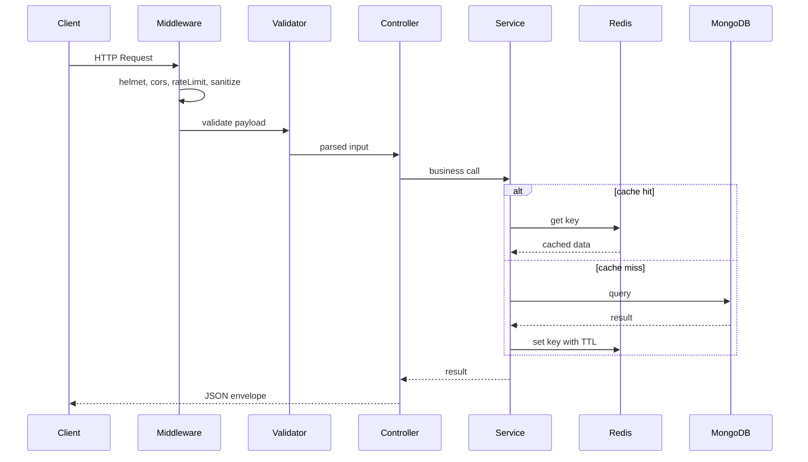

# System Overview

Commit Gear is a MERN-stack e-commerce platform for premium developer merchandise. This document defines service boundaries, data flows, and the backend layering contract.

## Topology



## Service Boundaries

| Service | Responsibility | Stateful? |
|---------|----------------|-----------|
| React SPA | UI, client cache (TanStack Query), optimistic cart | No |
| Express API | Business logic, auth, validation, orchestration | No (stateless) |
| MongoDB | Persistent data (users, products, orders, carts) | Yes |
| Redis | Read-through cache for catalog | Yes (ephemeral) |
| Cloudinary | Image storage and CDN delivery | Yes |
| Paystack | Payment processing and webhooks | External |

## Backend Layering Contract

Implementation in `backend/` must follow strict separation:

```
src/
├── routes/           # HTTP mapping only — no business logic
├── validators/       # Zod schemas derived from OpenAPI
├── controllers/      # Request/response orchestration
├── services/         # Business logic and transaction boundaries
├── repositories/     # Mongoose queries and persistence
├── providers/        # Swappable adapters (Paystack, Redis, Cloudinary)
├── middleware/       # Auth, error handler, rate limit, sanitize
├── config/           # Environment and connection config
└── utils/            # Logger, AppError, helpers
```

### Dependency Flow



**Rules:**
- Routes never import repositories directly
- Controllers never contain Mongoose queries
- Services receive providers via constructor injection (DI container)
- Providers implement interfaces defined in [`provider-abstractions.md`](provider-abstractions.md)

## Request Lifecycle



## Global Error Handling

All errors flow through a single middleware:

```json
{
  "success": false,
  "message": "Human-readable message",
  "error": {
    "code": "MACHINE_READABLE_CODE",
    "details": {}
  }
}
```

- Operational errors (validation, not found, conflict): log at `warn`, return appropriate 4xx
- Programming errors: log at `error` with stack trace, return 500 without leaking internals

## API Versioning

- Current version: `v1` (prefix `/api/v1`)
- Breaking changes require new version prefix; old version maintained for deprecation period

## Related Documents

- [Scaling Strategy](scaling-100k.md)
- [Provider Abstractions](provider-abstractions.md)
- [OpenAPI Contract](../api/openapi.yaml)
- [Double-Token Auth](../auth/double-token-flow.md)
