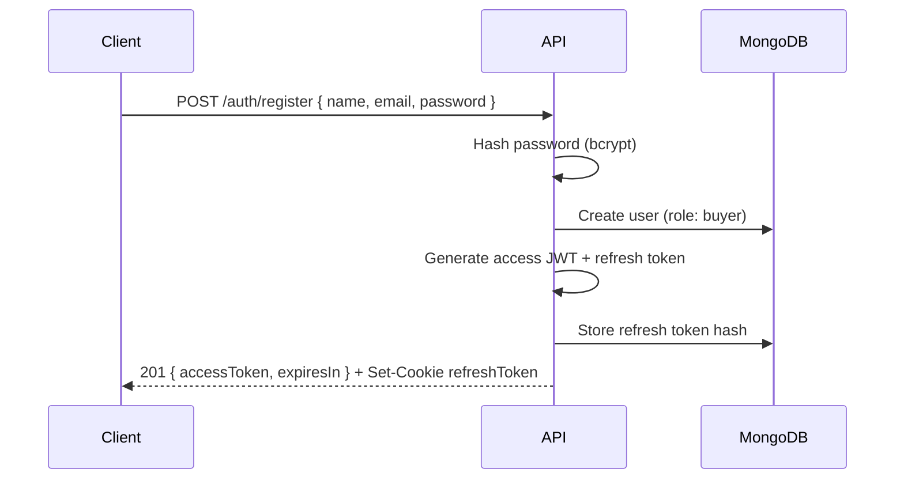
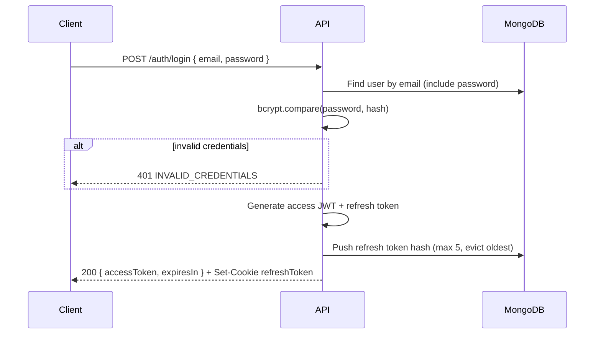
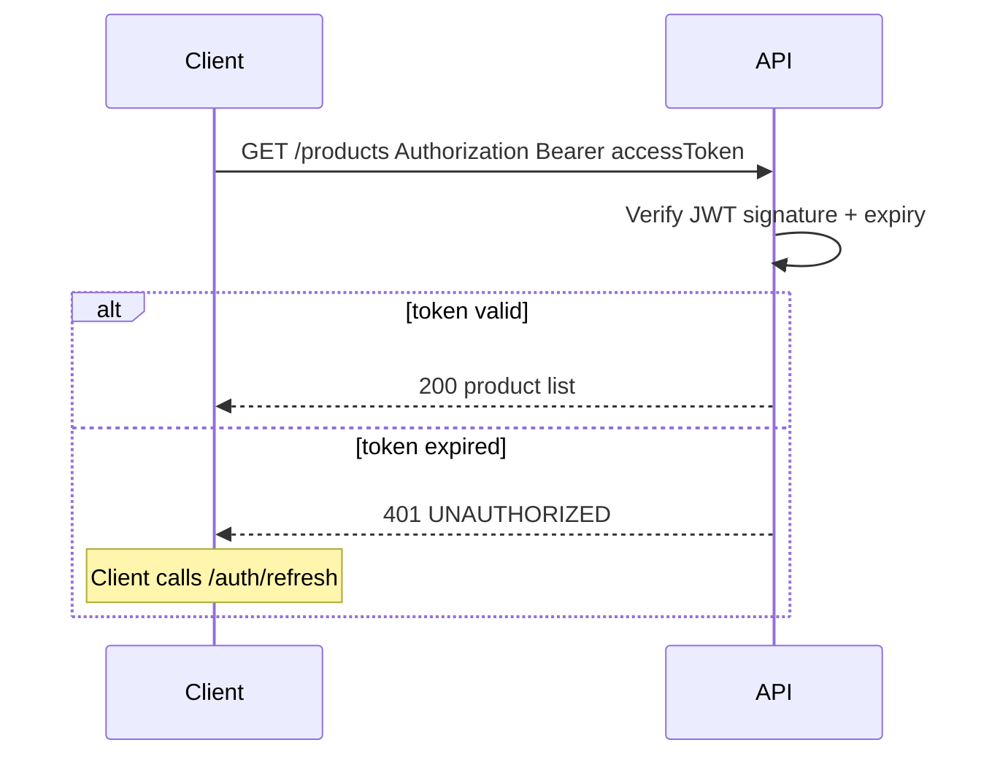
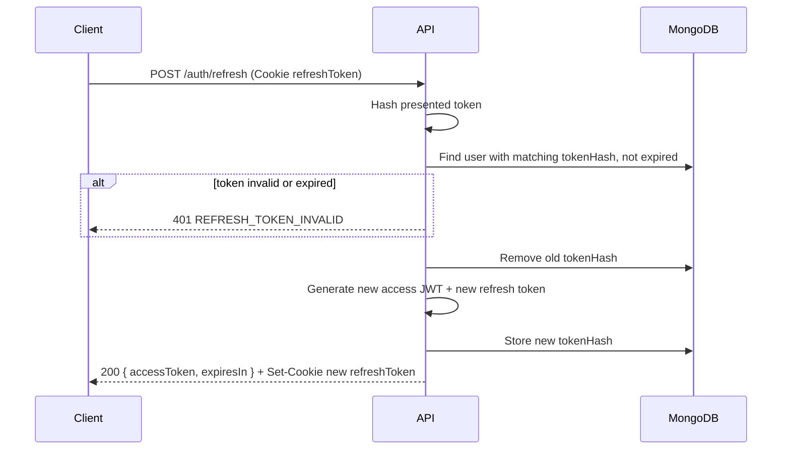

# Double-Token Authentication Flow

Detailed sequence for Commit Gear's access JWT + refresh cookie system.

## Token Summary

| Token | Lifetime | Storage | Rotation |
|-------|----------|---------|----------|
| Access JWT | 15 min | Client memory | Re-issued on `/auth/refresh` |
| Refresh token | 7 days | HttpOnly, Secure, SameSite=Strict cookie | Single-use; old hash removed on refresh |

## Registration Flow



## Login Flow



## Authenticated Request



## Token Refresh Flow



## Logout Flow

```mermaid
sequenceDiagram
  participant C as Client
  participant A as API
  participant DB as MongoDB

  C->>A: POST /auth/logout (Bearer + Cookie)
  A->>A: Verify access JWT
  A->>DB: Remove refresh token hash from cookie
  A-->>C: 200 + Set-Cookie refreshToken=; Max-Age=0
```

## Cookie Configuration

```
Set-Cookie: refreshToken=<token>;
  HttpOnly;
  Secure;
  SameSite=Strict;
  Path=/api/v1/auth;
  Max-Age=604800
```

| Attribute | Value | Purpose |
|-----------|-------|---------|
| `HttpOnly` | true | Prevent XSS access |
| `Secure` | true | HTTPS only |
| `SameSite` | Strict | CSRF mitigation |
| `Path` | `/api/v1/auth` | Scope to auth endpoints only |
| `Max-Age` | 604800 (7 days) | Refresh lifetime |

## Client Implementation Notes (Phase 1)

1. Store access token in React context or memory — **not** localStorage
2. Axios interceptor: on 401, attempt `POST /auth/refresh` with `credentials: 'include'`
3. On refresh success: retry original request with new access token
4. On refresh failure: redirect to login
5. TanStack Query `queryClient.clear()` on logout

## Security Considerations

- Refresh token raw value never logged
- Token hash stored server-side (SHA-256)
- Rate limit `/auth/login` and `/auth/refresh` (100/15min per IP)
- Account lockout after 10 failed logins in 15 min (implementation detail, Phase 1)

## Related

- [ADR 003: Double-Token Auth](../architecture/adr/003-double-token-auth.md)
- [Roles & Permissions](roles-and-permissions.md)
- [Auth API](../api/domains/auth.yaml)
