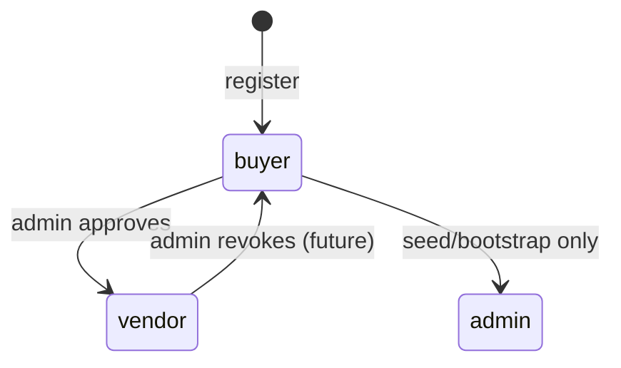

# Roles & Permissions

Access control matrix for Commit Gear. Maps to OpenAPI `x-roles` extensions and JWT `role` claim.

## Roles

| Role | Description |
|------|-------------|
| `buyer` | Default role. Browse, cart, checkout, view own orders |
| `vendor` | Create/manage own products, upload images |
| `admin` | Full platform management |

## Permission Matrix

| Endpoint | public | buyer | vendor | admin |
|----------|:------:|:-----:|:------:|:-----:|
| `POST /auth/register` | ✓ | | | |
| `POST /auth/login` | ✓ | | | |
| `POST /auth/refresh` | ✓ | | | |
| `POST /auth/logout` | | ✓ | ✓ | ✓ |
| `GET /auth/me` | | ✓ | ✓ | ✓ |
| `GET /products` | ✓ | ✓ | ✓ | ✓ |
| `GET /products/:id` | ✓ | ✓ | ✓ | ✓ |
| `POST /products` | | | ✓ | ✓ |
| `PATCH /products/:id` | | | ✓* | ✓ |
| `DELETE /products/:id` | | | ✓* | ✓ |
| `GET /categories` | ✓ | ✓ | ✓ | ✓ |
| `GET /categories/:id` | ✓ | ✓ | ✓ | ✓ |
| `POST /categories` | | | | ✓ |
| `PATCH /categories/:id` | | | | ✓ |
| `DELETE /categories/:id` | | | | ✓ |
| `GET /cart` | | ✓ | ✓ | ✓ |
| `POST /cart/items` | | ✓ | ✓ | ✓ |
| `PATCH /cart/items/:productId` | | ✓ | ✓ | ✓ |
| `DELETE /cart/items/:productId` | | ✓ | ✓ | ✓ |
| `DELETE /cart` | | ✓ | ✓ | ✓ |
| `POST /orders/checkout` | | ✓ | ✓ | ✓ |
| `GET /orders` | | ✓ | ✓ | ✓ |
| `GET /orders/:id` | | ✓** | ✓** | ✓ |
| `PATCH /orders/:id/status` | | | | ✓ |
| `POST /payments/initialize` | | ✓ | ✓ | ✓ |
| `POST /payments/webhook/paystack` | ✓*** | | | |
| `GET /payments/verify/:reference` | | ✓ | ✓ | ✓ |
| `POST /uploads/images` | | | ✓ | ✓ |
| `GET /admin/vendors` | | | | ✓ |
| `POST /admin/vendors/:id/approve` | | | | ✓ |
| `GET /admin/orders` | | | | ✓ |
| `PATCH /admin/products/:id/inventory` | | | | ✓ |

**Legend:**
- `✓*` Vendor may only modify/delete **own** products (`vendorId === userId`)
- `✓**` User may only view **own** orders (`userId === userId`)
- `✓***` Webhook authenticated via Paystack signature, not JWT

## Authorization Middleware

```typescript
function authorize(...allowedRoles: UserRole[]) {
  return (req, res, next) => {
    if (!req.user) return next(new UnauthorizedError());
    if (!allowedRoles.includes(req.user.role)) {
      return next(new ForbiddenError());
    }
    next();
  };
}
```

### Resource Ownership Checks

| Resource | Rule |
|----------|------|
| Product (vendor) | `product.vendorId === req.user.id` |
| Order (buyer) | `order.userId === req.user.id` |
| Cart | `cart.userId === req.user.id` |
| Payment verify | Order belongs to requesting user |

## Role Transitions



Vendor promotion: `POST /admin/vendors/:id/approve` sets `role: vendor`.

## JWT Role Claim

Access token payload includes `role`. Middleware reads role for `authorize()` checks. Role changes take effect on next token refresh (max 15 min delay). Force re-login on role change is optional Phase 1 enhancement.

## Related

- [Double-Token Flow](double-token-flow.md)
- [OpenAPI Security](../api/openapi.yaml)
