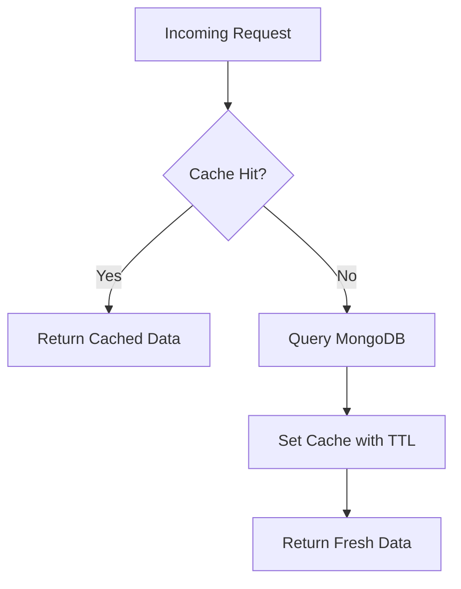

# Redis Caching Strategy

Read-through cache strategy for Commit Gear catalog and supporting data.

## Pattern: Cache-Aside



On write operations, affected cache keys are explicitly evicted before or after the database write (write-invalidate).

## TTL Configuration

| Key Pattern | TTL | Data | Rationale |
|-------------|-----|------|-----------|
| `categories:all` | 3600s (1h) | Full category list | Rarely changes |
| `products:list:{hash}` | 300s (5m) | Paginated/filtered product list | Balance freshness vs hit rate |
| `products:detail:{id}` | 600s (10m) | Single product document | Detail pages cached longer |
| `cart:{userId}` | — | Not cached | Always read from MongoDB |

## List Key Hashing

Product list cache keys include a hash of query parameters:

```typescript
function buildListCacheKey(params: ProductListParams): string {
  const normalized = {
    page: params.page ?? 1,
    limit: params.limit ?? 20,
    category: params.category ?? null,
    minPrice: params.minPrice ?? null,
    maxPrice: params.maxPrice ?? null,
    q: params.q ?? null,
  };
  const hash = createHash('sha256')
    .update(JSON.stringify(normalized))
    .digest('hex')
    .slice(0, 16);
  return `products:list:${hash}`;
}
```

## Eviction Triggers

| Write Operation | Keys Evicted |
|-----------------|--------------|
| `POST /products` | `products:list:*` |
| `PATCH /products/:id` | `products:list:*`, `products:detail:{id}` |
| `DELETE /products/:id` | `products:list:*`, `products:detail:{id}` |
| `POST /categories` | `categories:all`, `products:list:*` |
| `PATCH /categories/:id` | `categories:all`, `products:list:*` |
| `DELETE /categories/:id` | `categories:all`, `products:list:*` |
| `PATCH /admin/products/:id/inventory` | `products:list:*`, `products:detail:{id}` |

### Pattern Eviction Implementation

```typescript
async function evictByPattern(pattern: string): Promise<void> {
  let cursor = '0';
  do {
    const [nextCursor, keys] = await redis.scan(
      cursor, 'MATCH', pattern, 'COUNT', 100
    );
    cursor = nextCursor;
    if (keys.length > 0) {
      await redis.del(...keys);
    }
  } while (cursor !== '0');
}
```

## Serialization

- Format: JSON (`JSON.stringify` on write, `JSON.parse` on read)
- Envelope: Store only the `data` payload (not the full API envelope) to reduce size
- Compression: Not used in Phase 1 (payloads are small)

## Graceful Degradation

If Redis is unavailable:
1. Log warning
2. Fall through to MongoDB directly
3. Do not fail the request
4. Skip cache writes

Circuit breaker: after 5 consecutive Redis failures in 30s, bypass cache for 60s.

## Connection Configuration

```typescript
const redis = new Redis({
  host: config.REDIS_HOST,
  port: config.REDIS_PORT,
  password: config.REDIS_PASSWORD,
  maxRetriesPerRequest: 3,
  retryStrategy: (times) => Math.min(times * 100, 3000),
  lazyConnect: true,
});
```

## Monitoring

| Metric | Target |
|--------|--------|
| Cache hit rate (catalog) | > 85% |
| Eviction latency | < 50ms |
| Redis memory usage | < 80% of allocated |

## Related

- [Cache Key Catalog](cache-key-catalog.md)
- [ADR 004: Redis Cache Invalidation](../architecture/adr/004-redis-cache-invalidation.md)
- [Provider Abstractions](../architecture/provider-abstractions.md)
