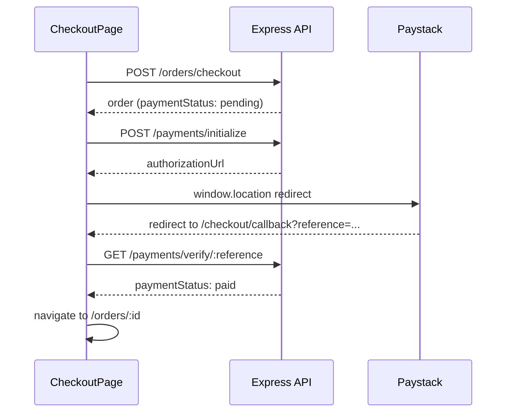

# Data Fetching

TanStack Query conventions for Commit Gear frontend.

## Axios Client

```typescript
const api = axios.create({
  baseURL: import.meta.env.VITE_API_URL + '/api/v1',
  withCredentials: true, // required for refresh cookie
});

api.interceptors.request.use((config) => {
  const token = authStore.getAccessToken();
  if (token) {
    config.headers.Authorization = `Bearer ${token}`;
  }
  return config;
});

api.interceptors.response.use(
  (response) => response,
  async (error) => {
    if (error.response?.status === 401 && !error.config._retry) {
      error.config._retry = true;
      const refreshed = await refreshAccessToken();
      if (refreshed) {
        error.config.headers.Authorization = `Bearer ${authStore.getAccessToken()}`;
        return api(error.config);
      }
      authStore.logout();
    }
    return Promise.reject(error);
  }
);
```

## Query Key Conventions

| Key | Endpoint | Stale Time | Notes |
|-----|----------|------------|-------|
| `['auth', 'me']` | `GET /auth/me` | 5 min | Invalidated on login/logout |
| `['categories']` | `GET /categories` | 30 min | Rarely changes |
| `['products', params]` | `GET /products` | 5 min | Params object in key |
| `['products', id]` | `GET /products/:id` | 10 min | |
| `['cart']` | `GET /cart` | 0 | Always fresh on mount |
| `['orders', params]` | `GET /orders` | 1 min | |
| `['orders', id]` | `GET /orders/:id` | 1 min | |
| `['admin', 'orders', params]` | `GET /admin/orders` | 30 sec | |
| `['admin', 'vendors']` | `GET /admin/vendors` | 1 min | |

### Query Key Factory

```typescript
export const queryKeys = {
  auth: {
    me: ['auth', 'me'] as const,
  },
  categories: {
    all: ['categories'] as const,
  },
  products: {
    list: (params: ProductListParams) => ['products', params] as const,
    detail: (id: string) => ['products', id] as const,
  },
  cart: {
    current: ['cart'] as const,
  },
  orders: {
    list: (params?: OrderListParams) => ['orders', params] as const,
    detail: (id: string) => ['orders', id] as const,
  },
  admin: {
    orders: (params?: AdminOrderParams) => ['admin', 'orders', params] as const,
    vendors: ['admin', 'vendors'] as const,
  },
};
```

## Query Configuration Defaults

```typescript
const queryClient = new QueryClient({
  defaultOptions: {
    queries: {
      retry: 1,
      refetchOnWindowFocus: false,
      staleTime: 60_000,
    },
    mutations: {
      retry: 0,
    },
  },
});
```

## Optimistic Cart Updates

Cart drawer and cart page use optimistic updates for instant feedback.

### Add to Cart

```typescript
function useAddToCart() {
  const queryClient = useQueryClient();

  return useMutation({
    mutationFn: (item: AddCartItemRequest) =>
      api.post('/cart/items', item).then((r) => r.data.data),

    onMutate: async (newItem) => {
      await queryClient.cancelQueries({ queryKey: queryKeys.cart.current });

      const previousCart = queryClient.getQueryData<Cart>(queryKeys.cart.current);

      if (previousCart) {
        const existing = previousCart.items.find(
          (i) => i.productId === newItem.productId
        );

        const optimisticCart: Cart = {
          ...previousCart,
          items: existing
            ? previousCart.items.map((i) =>
                i.productId === newItem.productId
                  ? { ...i, quantity: i.quantity + newItem.quantity }
                  : i
              )
            : [
                ...previousCart.items,
                {
                  productId: newItem.productId,
                  title: '...',
                  price: 0,
                  quantity: newItem.quantity,
                  image: '',
                  inventoryAvailable: 99,
                },
              ],
          itemCount: previousCart.itemCount + newItem.quantity,
          subtotal: previousCart.subtotal, // recalculated on settle
          updatedAt: new Date().toISOString(),
        };

        queryClient.setQueryData(queryKeys.cart.current, optimisticCart);
      }

      return { previousCart };
    },

    onError: (_err, _item, context) => {
      if (context?.previousCart) {
        queryClient.setQueryData(queryKeys.cart.current, context.previousCart);
      }
    },

    onSettled: () => {
      queryClient.invalidateQueries({ queryKey: queryKeys.cart.current });
    },
  });
}
```

### Update Quantity

Same pattern: `onMutate` adjusts quantity, `onError` rolls back, `onSettled` revalidates.

### Remove Item

Optimistically filter item from `items` array, rollback on error.

## Checkout Flow



## Mutation Invalidation Map

| Mutation | Invalidates |
|----------|-------------|
| Login / Register | `['auth', 'me']`, `['cart']` |
| Logout | All queries (`queryClient.clear()`) |
| Add/Update/Remove cart item | `['cart']` |
| Checkout | `['cart']`, `['orders']` |
| Create/Update product | `['products']`, `['categories']` |
| Payment verify | `['orders']`, `['orders', id]` |

## Error Handling

API errors follow the envelope: `{ success: false, message, error }`.

```typescript
function getErrorMessage(error: unknown): string {
  if (axios.isAxiosError(error) && error.response?.data?.message) {
    return error.response.data.message;
  }
  return 'Something went wrong';
}
```

Display via toast for mutations, inline for form validation.

## Prefetching

```typescript
// Prefetch product detail on card hover
function onProductCardHover(productId: string) {
  queryClient.prefetchQuery({
    queryKey: queryKeys.products.detail(productId),
    queryFn: () => fetchProduct(productId),
    staleTime: 600_000,
  });
}
```

## Related

- [Routes](routes.md)
- [Components](components.md)
- [OpenAPI Contract](../api/openapi.yaml)
