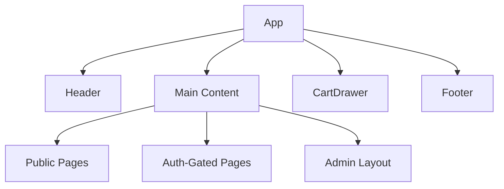

# Routes

Lazy-loaded React Router map for Commit Gear frontend.

## Route Table

| Path | Component | Auth | Lazy | Data Dependencies |
|------|-----------|------|------|-------------------|
| `/` | `HomePage` | No | Yes | `['products', { featured: true }]` |
| `/shop` | `ShopPage` | No | Yes | `['products', { page, limit }]` |
| `/shop/:category` | `CategoryPage` | No | Yes | `['products', { category, page }]` |
| `/product/:id` | `ProductDetailPage` | No | Yes | `['products', id]`, `['products', { category, limit: 4 }]` |
| `/cart` | `CartPage` | Yes | Yes | `['cart']` |
| `/checkout` | `CheckoutPage` | Yes | Yes | `['cart']`, checkout mutation |
| `/checkout/callback` | `CheckoutCallbackPage` | Yes | Yes | `['payments', 'verify', reference]` |
| `/orders` | `OrdersPage` | Yes | Yes | `['orders', { page }]` |
| `/orders/:id` | `OrderDetailPage` | Yes | Yes | `['orders', id]` |
| `/login` | `LoginPage` | No | Yes | — |
| `/register` | `RegisterPage` | No | Yes | — |
| `/admin` | `AdminLayout` | Admin | Yes | — |
| `/admin/orders` | `AdminOrdersPage` | Admin | Yes | `['admin', 'orders', { page }]` |
| `/admin/products` | `AdminProductsPage` | Admin | Yes | `['products', { page }]` |
| `/admin/vendors` | `AdminVendorsPage` | Admin | Yes | `['admin', 'vendors']` |
| `*` | `NotFoundPage` | No | Yes | — |

## Router Configuration

```typescript
const HomePage = lazy(() => import('./pages/HomePage'));
const ShopPage = lazy(() => import('./pages/ShopPage'));
// ... all pages lazy-loaded

<Routes>
  <Route path="/" element={<Suspense fallback={<PageSkeleton />}><HomePage /></Suspense>} />
  <Route path="/shop" element={<Suspense fallback={<PageSkeleton />}><ShopPage /></Suspense>} />
  <Route path="/shop/:category" element={<Suspense fallback={<PageSkeleton />}><CategoryPage /></Suspense>} />
  <Route path="/product/:id" element={<Suspense fallback={<PageSkeleton />}><ProductDetailPage /></Suspense>} />

  <Route element={<ProtectedRoute />}>
    <Route path="/cart" element={<Suspense fallback={<PageSkeleton />}><CartPage /></Suspense>} />
    <Route path="/checkout" element={<Suspense fallback={<PageSkeleton />}><CheckoutPage /></Suspense>} />
    <Route path="/checkout/callback" element={<Suspense fallback={<PageSkeleton />}><CheckoutCallbackPage /></Suspense>} />
    <Route path="/orders" element={<Suspense fallback={<PageSkeleton />}><OrdersPage /></Suspense>} />
    <Route path="/orders/:id" element={<Suspense fallback={<PageSkeleton />}><OrderDetailPage /></Suspense>} />
  </Route>

  <Route element={<AdminRoute />}>
    <Route path="/admin" element={<Suspense fallback={<PageSkeleton />}><AdminLayout /></Suspense>}>
      <Route path="orders" element={<AdminOrdersPage />} />
      <Route path="products" element={<AdminProductsPage />} />
      <Route path="vendors" element={<AdminVendorsPage />} />
    </Route>
  </Route>

  <Route path="*" element={<NotFoundPage />} />
</Routes>
```

## Layout Structure



- `Header`: logo, nav (Shop, Categories), cart icon with item count, auth links
- `CartDrawer`: slide-over panel, accessible from any page via cart icon
- `Footer`: minimal links, copyright

## Code Splitting

Each page is a separate chunk via `React.lazy()`. Shared dependencies (React, TanStack Query, Axios) remain in vendor chunk.

Target initial bundle: < 150 KB gzipped (excluding lazy chunks).

## SEO & Meta

| Page | Title Pattern |
|------|---------------|
| Home | `Commit Gear — Premium Developer Merch` |
| Shop | `Shop — Commit Gear` |
| Category | `{Category} — Commit Gear` |
| Product | `{Product Title} — Commit Gear` |

## Related

- [Data Fetching](data-fetching.md)
- [Components](components.md)
- [OpenAPI Contract](../api/openapi.yaml)
